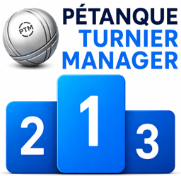

# Pétanque Toernooi Manager

*Read this in other languages: [🇩🇪 DE](README.md) | [🇬🇧 EN](README.en.md) | [🇫🇷 FR](README.fr.md) | [🇪🇸 ES](README.es.md) | [🇳🇱 NL](README.nl.md)*

---

## 🎯 Inleiding
De **Pétanque Toernooi Manager** is een krachtige, open-source toernooibeheersoftware die naadloos integreert als een extensie in **LibreOffice Calc**.

De software is speciaal ontwikkeld om de organisatie en uitvoering van jeu-de-boules- en pétanquetoernooien zo eenvoudig en efficiënt mogelijk te maken. Omdat het volledig offline werkt en direct in het spreadsheetprogramma draait, vereist het zeer weinig systeembronnen. Dit maakt het de ideale oplossing voor gebruik op de jeu-de-boulesbaan – zelfs op oudere laptops die bijvoorbeeld draaien op een lichtgewicht Linux-systeem.

**Voordelen op een rij:**
* **Onafhankelijk van besturingssysteem:** Werkt betrouwbaar op Linux, macOS en Windows.
* **Meertalig:** De gebruikersinterface ondersteunt meerdere talen, waaronder Duits (DE), Engels (EN), Frans (FR), Spaans (ES) en Nederlands (NL).
* **Gratis & Open Source:** Geen licentiekosten, geen reclame.
* **Efficiënt:** Perfect geschikt voor oudere hardware.
* **Alles op één plek:** Geen externe database nodig; alles wordt direct berekend en opgeslagen in LibreOffice Calc.
* **Ingebouwde webserver:** Toon alle toernooigegevens live op tv, tablet of smartphone – rechtstreeks vanuit LibreOffice, zonder externe software.

Available in Languages: 🇩🇪 DE | 🇬🇧 EN | 🇫🇷 FR | 🇪🇸 ES | 🇳🇱 NL

---

## 🛠️ Grenzeloze aanpasbaarheid: Maak er *jouw* toernooi van!

Het grootste unieke verkoopargument van deze toernooimanager is waarschijnlijk de basis: **LibreOffice Calc**. Omdat alle gegevens, tabellen en ranglijsten direct in reguliere Calc-werkbladen worden geschreven, zit je niet vast in een rigide programmastructuur.

> **💡 Volledige controle met de ingebouwde tools van Calc:** Je kunt **elk** gegenereerd toernooisysteem volledig vrij en naar eigen wens uitbreiden!

* **Internationale toernooien:** Dankzij de ingebouwde meertaligheid ben je perfect uitgerust voor toernooien met internationale gasten of grensoverschrijdende competities.
* **Eigen analyses:** Gebruik VERT.ZOEKEN, draaitabellen of eigen formules om teaminterne statistieken, puntengemiddelden of speciale ranglijsten uit de toernooigegevens te halen.
* **Visuele aanpassing:** Bouw je eigen dashboards, voeg clublogo's in, verander de lay-out voor het printen of ontwerp presentatieweergaven voor een beamer (bijv. voor de live weergave van de actuele ranglijst).
* **Eigen Macro's & Openbare API:** Als je geavanceerde functies nodig hebt, kun je altijd je eigen LibreOffice-macro's schrijven (Basic, Python, enz.). → [Macro's & Formules – volledige API-documentatie (Duitstalig)](https://github.com/michaelmassee/Petanque-Turnier-Manager/wiki/Makros-und-Formeln)

---

## 🏆 Ondersteunde toernooisystemen

* **Supermêlée / Mêlée:** Ideaal voor informele toernooien. Spelers worden elke ronde (of voor het hele toernooi) in nieuwe teams en tegen nieuwe tegenstanders geloot.
* **Competitie (Liga):** Voor het organiseren van een club- of regionale competitie met vaste teams. Ondersteunt HTML-export van uitslagen en speelschema's.
* **Zwitsers Systeem (Formule Suisse):** Het eerlijkste systeem voor toernooien met veel deelnemers en beperkte tijd. Inclusief automatische berekening van overwinningen, doelsaldo en Buchholz-punten voor exacte rangschikking.
* **Iedereen tegen Iedereen (Round Robin):** Het klassieke competitiesysteem.
* **Knock-out Systeem (Directe eliminatie):** Voor klassieke finalerondes. Bij een aantal deelnemers dat geen macht van twee is, wordt automatisch een tussenronde (cadrage) berekend.
* **Maastrichts Systeem:** Combineert het Zwitsers Systeem met knock-out finalerondes. Teams worden in meerdere voorronden (2–5) volgens het Zwitserse algoritme gekoppeld. Daarna worden de teams op basis van hun aantal overwinningen ingedeeld in prestatiegroepen (A, B, C, D) – elke groep speelt zijn eigen knock-out finale. Resultaat: vier toernooiwinnaars, eerlijke groepsindeling en spannende finales.

* **Poule-A/B-systeem:** Klassieke modus met groepsfase (Poules) volgens het principe van dubbele eliminatie (light), gevolgd door een verdeling in A-toernooi (hoofdtoernooi) en B-toernooi (troosttoernooi).
* **Cascaderend Knock-out Systeem (Uitgebreid ABCD-systeem):** Breidt het klassieke ABCD-knock-outsysteem uit met zoveel extra niveaus als gewenst (E, F, G, H …). In plaats van vroeg uitgeschakeld te worden, zakken verliezende teams stap voor stap door naar lagere troosttoernooien. Na een configureerbaar minimum aantal rondes schakelt elk niveau over naar zuiver knock-outformaat – met een eigen cadrage indien nodig. Geschikt voor middelgrote tot grote toernooien (vanaf 16 teams).
* **Formule X:** Modern rondesysteem uit de Franse pétanque – ideaal voor grote velden en toernooien met tijdlimiet. Alle teams spelen evenveel rondes; niemand valt af. De rangschikking wordt bepaald door een duidelijke cumulatieve score (overwinningsbonus + eigen punten + puntenverschil) – zonder Buchholz. Ronde 1 wordt vrij geloot; vanaf ronde 2 worden koppels bepaald op basis van de ranglijst: 1e vs. 2e, 3e vs. 4e, enz.

---

## 🌐 Ingebouwde webserver – Live weergave op de toernooidag

De Pétanque Toernooi Manager heeft een **volledig ingebouwde webserver** – rechtstreeks vanuit LibreOffice Calc, zonder externe software of internetverbinding.

Terwijl het toernooi bezig is, kunnen alle sheets in een browser worden bekeken op **tv, laptop, tablet of smartphone** – in realtime, automatisch bijgewerkt:

* 📋 **Deelnemerslijsten** – wie speelt er mee?
* 🎯 **Huidige speelronde** – welke wedstrijden lopen er nu?
* 🏆 **Ranglijsten** – live bijgewerkt na elke ronde
* 📊 **Eigen tabellen** – publiceer elke gewenste Calc-sheet

> **💡 Zo eenvoudig:** Start de webserver via het menu → open de URL in een browser → klaar. Alle apparaten op hetzelfde wifi-netwerk zien de toernooigegevens live.

**Technische details:**
* React-frontend met **Server-Sent Events (SSE)** – directe updates zonder herladen van de pagina
* Tot **10 URL's tegelijkertijd** configureerbaar
* Zoom, centrering en kopteksten/voetteksten instelbaar per poort
* Alle toernooisystemen ondersteund: Supermêlée, Zwitsers systeem, Iedereen tegen iedereen, K.-O., Maastrichts systeem, Formule X

---

## 💻 Systeemvereisten

* **LibreOffice:** vanaf versie 25.x (of nieuwer)
* **Java (JRE/JDK):** vanaf versie 25
* **Besturingssysteem:** Linux, macOS of Windows

---

## ⚙️ Installatie & Instellingen

### Stap 1: Java installeren
* **Temurin Adoptium JDK (LTS):** [Gratis download hier](https://adoptium.net/)
* **Oracle Java:** [Officiële download hier](https://www.oracle.com/java/technologies/downloads/)

### Stap 2: Java activeren in LibreOffice
1. Open **LibreOffice**. Ga naar `Extra` ▸ `Opties` ▸ `LibreOffice` ▸ `Geavanceerd`. *(Op macOS: `LibreOffice` ▸ `Voorkeuren...`)*
2. Vink het vakje **"Een Java-runtime-omgeving gebruiken"** aan.
3. Selecteer de geïnstalleerde JRE in de lijst. Bevestig met `OK` en herstart LibreOffice.

### Stap 3: De extensie installeren
1. Download de nieuwste versie van de extensie (`PetanqueTurnierManager-vx.xx.oxt`) onder het kopje [Releases](https://github.com/michaelmassee/Petanque-Turnier-Manager/releases).
2. Dubbelklik op het `.oxt` bestand. LibreOffice opent automatisch **Extensiebeheer**.
3. Bevestig de installatie.

---

## 🚀 Eerste stappen & Gebruik

1. Start **LibreOffice Calc** en open een volledig leeg, nieuw werkblad.
2. Kijk in de bovenste menubalk van Calc. Daar vind je nu een nieuw menu-item genaamd **"PétTurnMngr"**.
3. Klik hierop om het controlecentrum te openen. Je kunt nu spelers toevoegen, de toernooimodus selecteren en de rondes genereren.
4. Voer eenvoudig de resultaten in de gegenereerde velden in; de tabellen en volgende rondes worden automatisch met een druk op de knop berekend.

---

## 📖 Documentatie & Hulp
De volledige documentatie is te vinden op onze officiële Wiki (momenteel in het Duits):
👉 **[Ga hier naar de Project Wiki](https://github.com/michaelmassee/Petanque-Turnier-Manager/wiki)**

**Licentie:** Dit project is gelicentieerd onder de [EUPL-1.2 Licentie](LICENSE).